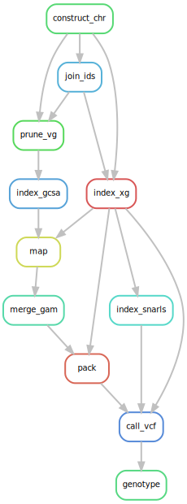
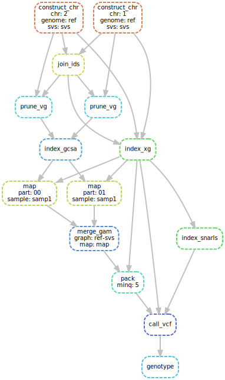
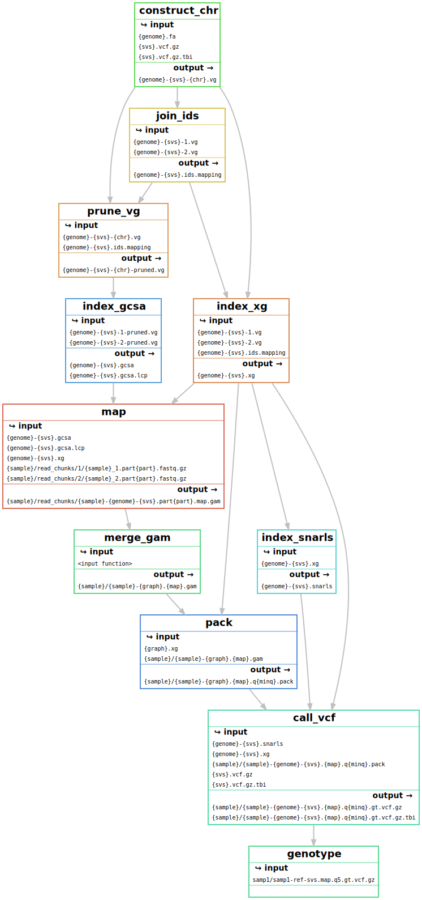
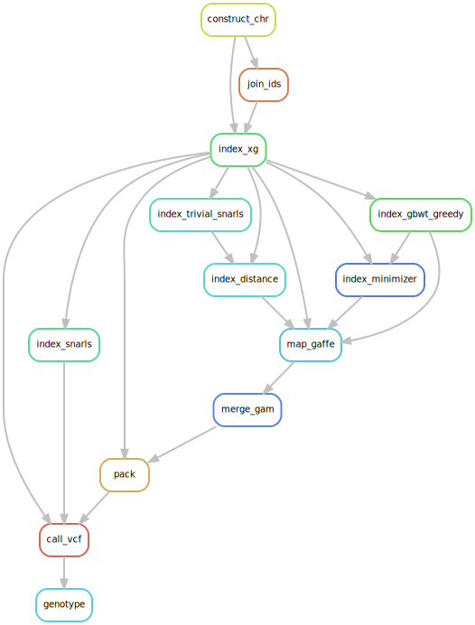
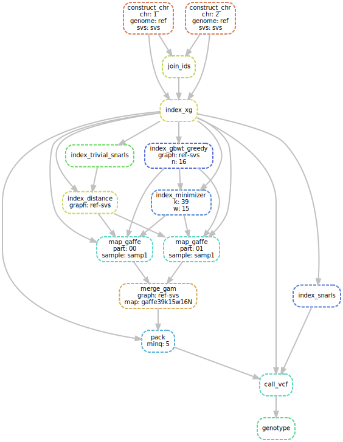
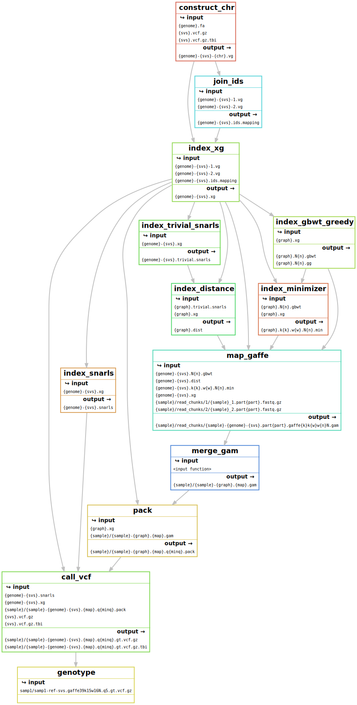

This repository contains a [Snakemake](https://snakemake.readthedocs.io/en/stable/index.html) workflow for the [vg toolkit](https://github.com/vgteam/vg).
In the current stage it's simply a place to host a usable `Snakefile` and `config.yaml` files.
With it, you can build a variation graph from a reference FASTA file and variants in a VCF file, map reads to the graph and genotype those variants.

For now, this workflow has been used locally or on a large AWS/Kubernetes instance.
We will soon test it on a HPC system and update the examples below.

**This workflow was tested on [vg 1.21.0](https://github.com/vgteam/vg/releases/tag/v1.21.0).**

- [Input files](#input-files)
- [Examples](#examples)
- [Overview of the workflow](#overview-of-the-workflow)
- [Overview of the workflow when using the Giraffe mapper](#overview-of-the-workflow-when-using-the-giraffe-mapper)
- [FAQ](#faq)

## Input files

To use the workflow you should first copy the `Snakefile` and `config.yaml` files in the working directory. 

### Graph construction

For construction, two files are necessary in the working directory:

1. a reference file named `{GENOME}.fa`
1. a VCF file called `{VARIANTS}.vcf.gz` (sorted and indexed)

The `{GENOME}` and `{VARIANTS}` labels should match the *graph* label in the configuration (*config.yaml* file or in the command line).
The corresponding *graph* label is `{GENOME}-{VARIANTS}`.
These labels shouldn't contain the character `-`.

### Mapping and genotyping samples

The reads for each sample should be in a folder named with the sample name.
In the `{sample}` folder, FASTQ files should be named `{sample}_1.fastq.gz` and `{sample}_2.fastq.gz`.
The sample names shouldn't contain the character `-`.

## Examples

The two rules used most in practice are:

1. *construct_all* to build the graph and all the necessary indexes for mapping and variant calling.
1. *genotype* to map reads and genotype samples.

See an example on a small dataset in the [`testdata` folder](testdata/).

### Construct a variation graph

To build a graph from a `hg38.fa` and a `hgsvc.vcf.gz`, you would use `graph: "hg38-hgsvc"` in *config.yaml* and:

```
snakemake --configfile config.yaml --resources mem_mb=200000 --cores 16 construct_all
```

Or specify the *graph* label in the command line:

```
snakemake --configfile config.yaml --config graph="hg38-hgsvc" --resources mem_mb=200000 --cores 16 construct_all
```

Note the `--resources mem_mb=200000 --cores 16` which specifies the maximum amount memory or cores to use.

### Map reads and genotype variants

Let's assume the graph indexes constructed (see above) and you want to analyze reads for 2 samples in `SAMP1/SAMP1_*.fastq.gz` and `SAMP2/SAMP2_*.fastq.gz`.

```
snakemake --configfile config.yaml --config samples="SAMP1 SAMP2" --resources mem_mb=100000 --cores 16 genotype
```

(Assuming that the *graph* label, e.g. *hg38-hgsvc*, is defined in the *config.yaml* file)

## Overview of the workflow

We can easily visualize the workflow with [Snakemake](https://snakemake.readthedocs.io/en/stable/index.html).
Her we use the small test data with two chromosomes,  one sample, and reads split in 2 chunks (more info in the [`testdata` folder](testdata/)).

### Rule graph



### DAG of jobs



### File graph



## Overview of the workflow when using the Giraffe mapper

The newer and faster mapper, giraffe, uses different graph indexes.

### Rule graph



### DAG of jobs



### File graph




## FAQ

### How do I specify the resources?

When running locally or on an instance, we use `--resources mem_mb=200000 --cores 16` to specify the maximum memory and cores to use. 

To run on an HPC, you would need to add the HPC specific configuration (more details soon).

The current resources listed in `config.yaml` were tuned for a human genome. 

### Where can I run this?

You can run this on any resource supported by [Snakemake](https://snakemake.readthedocs.io/en/stable/index.html). 
For example, locally and on HPC.

### Can I use the workflow for non-human organisms?

Yes, juts remember to update the chromosome names in the `config.yaml`.

### Why are there AWS/S3 commands in the workflow?

We sometimes run the workflow on an AWS instance and use these command to save the outputs in a S3 bucket.
If you don't want to do this, use the default config value `s3save: False`.
